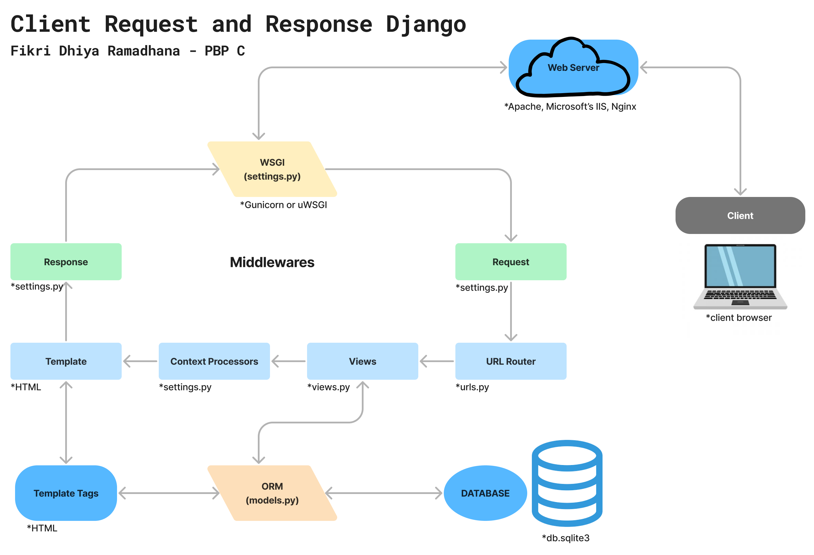

## Tautan Aplikasi Adaptable
Berikut adalah tautan deployment app saya [Fantasy Guild Market](https://fantasy-guild-market.adaptable.app/main/)

## Membuat Proyek Django Baru
1. Membuat direktori utama, yaitu FANTASY-GUILD-MARKET
2. Buka terminal, lalu cd ke direktori utama dan jalankan command `python3 -m venv env` (Mac/Linux) untuk membuat virtual environment
3. Jalakan virtual environment dengan command `source env/bin/activate` (Mac/Linux). Jika sudah aktif, maka ditandai oleh (env), env ini berguna untuk mengisolasi *package* dan *dependencies* dari aplikasi agar tidak terjadi kendala antar versi lain.
4. Membuat file requirement.txt yang berisi django dan dependencies lain untuk diinstall ke dalam proyek dengan command `pip install -r requirements.txt`
5. Membuat project Django bernama fantasy_guild_market dengan command `django-admin startproject fantasy_guild_market .` Lalu subdirektori akan terbuat dengan file bawaan, yaitu: __init__.py, asgi.py, settings.py, urls.py, wsgi.py.
6. Tambahkan "*" ke dalam ALLOWED_HOSTS agar mendapatkan akses host dari aplikasi web sebagai keperluan deployment.
7. Jalankan berkas manage.py dengan menyalakan virtual environment terlebih dahulu (step 3), lalu menjalankan command `python3 manage.py runserver` (Mac/Linux).
8. Lalu buka [localhost](http://localhost:8000/main/).
    * Untuk mematikan server bisa dilakukan dengan menekan control + C dan command `deactivate` untuk mematikan env.
9. Membuat repositori GitHub baru bernama fantasy-guild-market dengan visibilitas public dan settings yang lain default.
10. Jalankan command `git init` di terminal dengan cd direktori utama file lokal, yaitu FANTASY-GUILD-MARKET.
11. Buat berkas .gitignore di dalam direktori utama dengan isi:
    ```
    # Django
    *.log
    *.pot
    *.pyc
    __pycache__
    db.sqlite3
    media

    # Backup files
    *.bak 

    # If you are using PyCharm
    # User-specific stuff
    .idea/**/workspace.xml
    .idea/**/tasks.xml
    .idea/**/usage.statistics.xml
    .idea/**/dictionaries
    .idea/**/shelf

    # AWS User-specific
    .idea/**/aws.xml

    # Generated files
    .idea/**/contentModel.xml

    # Sensitive or high-churn files
    .idea/**/dataSources/
    .idea/**/dataSources.ids
    .idea/**/dataSources.local.xml
    .idea/**/sqlDataSources.xml
    .idea/**/dynamic.xml
    .idea/**/uiDesigner.xml
    .idea/**/dbnavigator.xml

    # Gradle
    .idea/**/gradle.xml
    .idea/**/libraries

    # File-based project format
    *.iws

    # IntelliJ
    out/

    # JIRA plugin
    atlassian-ide-plugin.xml

    # Python
    *.py[cod] 
    *$py.class 

    # Distribution / packaging 
    .Python build/ 
    develop-eggs/ 
    dist/ 
    downloads/ 
    eggs/ 
    .eggs/ 
    lib/ 
    lib64/ 
    parts/ 
    sdist/ 
    var/ 
    wheels/ 
    *.egg-info/ 
    .installed.cfg 
    *.egg 
    *.manifest 
    *.spec 

    # Installer logs 
    pip-log.txt 
    pip-delete-this-directory.txt 

    # Unit test / coverage reports 
    htmlcov/ 
    .tox/ 
    .coverage 
    .coverage.* 
    .cache 
    .pytest_cache/ 
    nosetests.xml 
    coverage.xml 
    *.cover 
    .hypothesis/ 

    # Jupyter Notebook 
    .ipynb_checkpoints 

    # pyenv 
    .python-version 

    # celery 
    celerybeat-schedule.* 

    # SageMath parsed files 
    *.sage.py 

    # Environments 
    .env 
    .venv 
    env/ 
    venv/ 
    ENV/ 
    env.bak/ 
    venv.bak/ 

    # mkdocs documentation 
    /site 

    # mypy 
    .mypy_cache/ 

    # Sublime Text
    *.tmlanguage.cache 
    *.tmPreferences.cache 
    *.stTheme.cache 
    *.sublime-workspace 
    *.sublime-project 

    # sftp configuration file 
    sftp-config.json 

    # Package control specific files Package 
    Control.last-run 
    Control.ca-list 
    Control.ca-bundle 
    Control.system-ca-bundle 
    GitHub.sublime-settings 

    # Visual Studio Code
    .vscode/* 
    !.vscode/settings.json 
    !.vscode/tasks.json 
    !.vscode/launch.json 
    !.vscode/extensions.json 
    .history
    ```
    Berkas ini bertujuan untuk mengabaikan file - file dan direktori yang harus diabaikan oleh Git. 

12. Lakukan git add, commit, dan push dari direktori repositori lokal. 

## Membuat aplikasi dengan nama main pada proyek FANTASY-GUILD-MARKET
1. Pastikan (env) sudah dinyalakan. 
2. Jalankan command `python3 manage.py startapp main` (Mac/Linux) di lokal direktori utama. 
3. Setelah main sudah muncul di dalam direktori, lalu tambahkan main list INSTALLED_APPS di dalam settings.py yang berada di subdirektori fantasy_guild_market, seperti: 
    ```python
    INSTALLED_APPS = [
        ...,
        'main',
        ...
    ]
    ```

## Melakukan routing pada proyek agar bisa menjalankan main
1. Buka file urls.py di dalam direktori fantasy_guild_market. 
2. Tambahkan isi dari urls.py dengan kode, yaitu:
    ```python
    from django.urls import path, include
    ```
    ```python
    urlpatterns = [
        ...
        path('main/', include('main.urls')),
        ...
    ]
    ```
3. include dibutuhkan karena kita akan me-routing main.urls yang dimana selain 'admin/' oleh karena itu dibutuhkan fungsi include.

## Membuat model pada aplikasi main dengan nama Item dan memiliki atribut
1. Pada step ini, kita perlu mengedit isi dari models.py dengan kode:
    ```python
    from django.db import models

    # Create your models here.
    class Items(models.Model):
        # name, amount, description merupakan komponen wajib yang berupa CharField, IntegerField, dan TextField
        name = models.CharField(max_length=255)          
        amount = models.IntegerField()                  
        description = models.TextField()             
        price = models.IntegerField()
        power = models.IntegerField()
        date_added = models.DateField(auto_now_add=True)
    ```
2. Jalankan perintah `python manage.py makemigrations` dan `python manage.py migrate`, kode ini bertujuan untuk menciptakan dan mengaplikasikan perubahan model ke dalam basis data.

## Membuat fungsi pada views.py di dalam direktori main
1. Buka file views.py dan tambahkan `from django.shortcuts import render` yang bertujuan agar data - data yang berada di dalam struktur data views.py dapat di-render dan ditampilkan di HTML.
    ```python
    def show_main(request):
        context = {
            'name': 'Fikri Dhiya Ramadhana',
            'class': 'PBP C',
            'amount': 0,
            'items' : "long sword",
            'price' : 200,
            'power' : 100,
            'description' : "long double-edged sword",
        }
        return render(request, "main.html", context)
    ```
2. Untuk menampilkan data yang berada di dalam views.py, gunakan syntax {{ key }}, lalu HTML akan menampilkan value yang ada dari key yang dipanggil. 

## Membuat routing pada urls.py di dalam direktori main
1. Hal ini dilakukan untuk memetakan fungsi yang dibuat di dalam views.py.
2. Buat file di dalam direktori main dengan nama urls.py.
3. Isi file dengan kode: 
    ```python
    from django.urls import path
    from main.views import show_main

    app_name = 'main'

    urlpatterns = [
        path('', show_main, name='show_main'),
    ]
    ```
4. urls.py yang berada di main bertanggung jawab untuk mengatur rute URL yang terkait dengan aplikasi main.

## Melakukan Deployment ke Adaptable
1. Login/SignUp ke akun [Adaptable.io](https://adaptable.io/) menggunakan akun GitHub.
2. Saat sudah login, klik New App, lalu pilih Connect an Existing Repository. Hal ini bertujuan agar semua repositori yang ada di akun GitHub kamu bisa terbaca. 
3. Lalu pilih direktori fantasy-guild-market atau repositori lain yang ingin di-deploy. 
4. Pilih branch yang ingin dijadikan sebagai deployment branch. 
5. Pilih **Python App Template** (template) dan **PostgreSQL** (basis data) yang akan digunakan.
6. Pilih versi python yang sesuai. Jika lupa, gunakan command `python3 --version` (Mac/Linux) untuk mengetahui versi python yang terinstall. 
7. Pada bagian Start Command, masukkan command `python3 manage.py migrate && gunicorn fantasy_guild_market.wsgi` (Mac/Linux).
8. Masukkan nama aplikasi yang diinginkan dan centang bagian HTTP Listener on PORT dan klik Deploy App untuk memulai proses app deployment.

## Bagan Client Request and Response Django

### Penjelasan Bagan
1. Browser yang diakses oleh client akan me-request ke dalam Web Server.
2. Request dari client akan diproses oleh Web Server.
3. Server HTTP akan diproses oleh WSGI untuk web yang berbasis python.
4. Request client akan dilanjutkan ke middleware request yang menjadi penghubung proyek dalam memproses request. 
5. Alamat request dari client akan di-direct oleh URL Router ke dalam fungsi di dalam views.py.
6. Kemudian, views.py akan me-render data - data yang akan ditampilkan di dalam template HTML. Data yang diproses merupakan data yang sudah diatur oleh ORM dalam file models.py.
7. Lalu data - data dari views.py akan dikirimkan oleh context processor ke template HTML.
8. Data yang tampil di template HTML akan sesuai dengan logika dari template tags. 
9. Middleware Response akan memproses dan meneruskan response ke WSGI.
10. Server HTTP untuk web berbasis python akan diproses oleh WSGI.
11. Lalu, web server akan menerima dan meneruskan response ke client.
12. Response diterima oleh client.

## Mengapa kita menggunakan virtual environment?
&nbsp;&nbsp;&nbsp;&nbsp;&nbsp;&nbsp;&nbsp;&nbsp;&nbsp;&nbsp;Virtual environment sangat berguna untuk dependencies terhadap proyek satu dengan yang lain atau terisolasi. Dalam penggunaannya, virtual environment memudahkan kita untuk melihat semua dependencies dari proyek yang kita buat di dalam **requirements.txt**. Dan penggunaan virtual environment dapat meningkatkan portabilitas karena memungkinkan kita untuk menjalankan proyek Django kita secara konsisten dan independen di berbagai lingkungan.

## Apa kita tetap bisa membuat proyek Django tanpa menggunakan virtual environment?
&nbsp;&nbsp;&nbsp;&nbsp;&nbsp;&nbsp;&nbsp;&nbsp;&nbsp;&nbsp;Bisa, namun tidak disarankan karena memungkinkan terjadinya konflik terhadap proyek yang dibuat, contohnya konflik terhadap dependencies karena akan sulit dikelola, ketidakstabilan proyek karena suatu saat sistem konfigurasinya dapat berubah - ubah, dan hal ini juga bergantung pada versi Django saat membuat proyek dan penggunaan dependencies tertentu yang berbeda, jika tidak sesuai maka akan menimbulkan konflik terhadap sistem. 

## Apa itu MVC, MVT, MVVM dan apa perbedaannya?
Ketiga itu adalah pola bentuk arsitektur dalam sebuah proyek yang memberikan modularitas pada file proyek dan memastikan kode ter-cover dalam suatu uji testing yang memiliki persamaan:
* Model: untuk menyimpan data aplikasi yang terhubung dengan database. 
* View: menerima masukkan data dan menampilkan informasi ke client.

1. MVC (Model-View-Controller)
    * Controller: merupakan jembatan antara model dan view dalam mengelola permintaan client.

2. MVT (Model-View-Template)
    * Template: tempat untuk menampilkan atau me-render data dengan kode HTML yang bersifat *static* atau *dynamic*.

3. MVVM (Model-View-ViewModel)
    * ViewModel: merupakan perantara antar model dan view yang berperan sebagai stream data server sehingga data yang berada dimodel akan ditampilkan oleh view sesuai dengan format yang diperbolehkan.

* Perbedaan MVC, MVT, MVVM

    | MVC     | MVT    | MVVM   |
    | :--------: |:--------:| :-------:|
    | Input client diterima oleh Controller     |   Input client diterima oleh View        |  Input client diterima oleh View dan menjadi entry point dari aplikasi        |
    | Controller dan View memiliki relasi one-to-many  | Template dan View memiliki relasi one-to-one | View dan ViewModel memiliki relasi one-to-many |
    | Rumit untuk dimodifikasi  | Mudah untuk dimodifikasi | Mudah untuk dimodifikasi jika data binding tidak terlalu complex  |
    | Tidak mememerlukan URL Mapping | Memerlukan URL Mapping  | Tidak terlalu bergantung terhadap URL Mapping |
